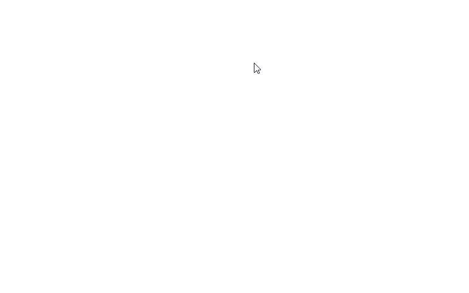

# PolygonFill
A program where you draw a polygon and then it gets filled.

The program was made with <i>Processing 3.5.7</i>.
 There is also <i>.exe</i> executable file for <b>Windows x64</b> and the executable for <b>Linux x64</b>.

## Instructions:
<b>LEFT MOUSE BUTTON</b> to add vertices to the polygon.
 <b>RIGHT MOUSE BUTTON</b> to fill the polygon.
 <b>SPACE</b> to clear the canvas.
 <b>BACKSPACE</b> to remove the last vertice from the polygon.

## Animation:

